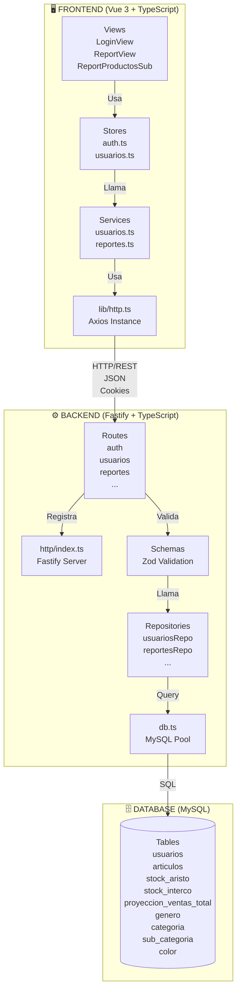
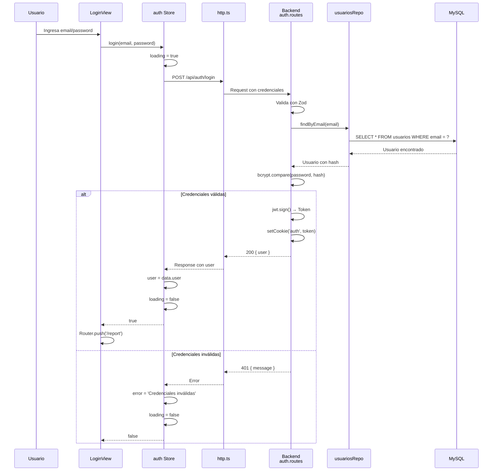
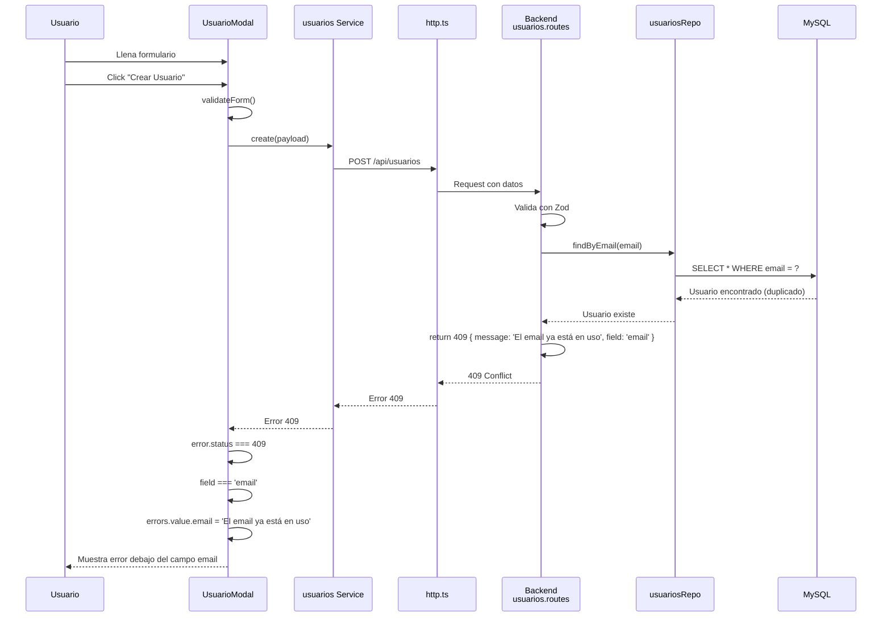

# Análisis Completo y Actualizado - Fase 2
## Sistema de Apoyo a la Decisión de Compras con Machine Learning

---

## 📋 ÍNDICE

1. [Stack Tecnológico](#stack-tecnologico)
2. [Arquitectura General](#arquitectura-general)
3. [Base de Datos](#base-de-datos)
4. [Backend - Análisis Completo](#backend)
5. [Frontend - Análisis Completo](#frontend)
6. [Flujos de Interacción](#flujos-interaccion)
7. [Diagramas de Comunicación](#diagramas)

---

# 🛠️ STACK TECNOLÓGICO

## Backend

### **Node.js** (Runtime)
- **Qué es**: Entorno de ejecución JavaScript del lado del servidor
- **Por qué se usa**: Permite ejecutar JavaScript fuera del navegador, ideal para APIs REST
- **Versión**: >=18.17
- **Función en la app**: Ejecuta el servidor Fastify y todas las operaciones del backend

### **TypeScript** (Lenguaje)
- **Qué es**: Superset de JavaScript que añade tipado estático
- **Por qué se usa**: Detecta errores en tiempo de compilación, mejora mantenibilidad
- **Versión**: ^5.9.3
- **Función en la app**: Todo el código backend está en TypeScript para mayor seguridad de tipos

### **Fastify** (Framework Web)
- **Qué es**: Framework web rápido y eficiente para Node.js
- **Por qué se usa**: Alto rendimiento, bajo overhead, mejor que Express en velocidad
- **Versión**: ^5.6.1
- **Función en la app**: 
  - Crea el servidor HTTP
  - Maneja rutas y middlewares
  - Gestiona plugins (CORS, cookies, JWT)

### **MySQL2** (Driver de Base de Datos)
- **Qué es**: Cliente MySQL para Node.js con soporte para Promises
- **Por qué se usa**: Conexión nativa a MySQL, mejor rendimiento que ORMs pesados
- **Versión**: ^3.15.2
- **Función en la app**: 
  - Pool de conexiones a MySQL
  - Ejecuta queries SQL
  - Maneja transacciones

### **Zod** (Validación de Schemas)
- **Qué es**: Biblioteca de validación TypeScript-first
- **Por qué se usa**: Valida datos de entrada, genera tipos automáticamente
- **Versión**: ^4.1.12
- **Función en la app**: 
  - Valida datos de requests (email, password, etc.)
  - Valida variables de entorno
  - Genera mensajes de error estructurados

### **bcryptjs** (Hash de Contraseñas)
- **Qué es**: Biblioteca para hashear contraseñas de forma segura
- **Por qué se usa**: Algoritmo bcrypt, resistente a ataques de fuerza bruta
- **Versión**: ^3.0.3
- **Función en la app**: 
  - Hashea contraseñas antes de guardarlas
  - Compara contraseñas en login sin almacenarlas en texto plano

### **@fastify/jwt** (Autenticación)
- **Qué es**: Plugin de Fastify para manejar JSON Web Tokens
- **Por qué se usa**: Autenticación stateless, tokens firmados criptográficamente
- **Versión**: ^10.0.0
- **Función en la app**: 
  - Genera tokens JWT al hacer login
  - Verifica tokens en requests protegidos
  - Almacena tokens en cookies HTTP-only

### **@fastify/cookie** (Manejo de Cookies)
- **Qué es**: Plugin para manejar cookies en Fastify
- **Por qué se usa**: Almacenar tokens de forma segura (HTTP-only)
- **Versión**: ^11.0.2
- **Función en la app**: 
  - Guarda token JWT en cookie 'auth'
  - Lee cookies en cada request
  - Limpia cookies al hacer logout

### **@fastify/cors** (CORS)
- **Qué es**: Plugin para habilitar Cross-Origin Resource Sharing
- **Por qué se usa**: Permite que el frontend (puerto 5173) llame al backend (puerto 3001)
- **Versión**: ^11.1.0
- **Función en la app**: 
  - Permite requests desde `http://localhost:5173`
  - Habilita credenciales (cookies) en requests cross-origin

---

## Frontend

### **Vue 3** (Framework Frontend)
- **Qué es**: Framework progresivo para construir interfaces de usuario
- **Por qué se usa**: Reactivo, fácil de aprender, excelente rendimiento
- **Versión**: ^3.5.18
- **Función en la app**: 
  - Componentes reactivos
  - Sistema de reactividad
  - Directivas (v-if, v-for, v-model)

### **TypeScript** (Lenguaje)
- **Qué es**: Mismo que en backend
- **Versión**: ~5.8.3
- **Función en la app**: Tipado en componentes, stores, servicios

### **Vite** (Build Tool)
- **Qué es**: Herramienta de build ultra-rápida
- **Por qué se usa**: Hot Module Replacement (HMR) instantáneo, builds rápidos
- **Versión**: ^7.2.1
- **Función en la app**: 
  - Servidor de desarrollo
  - Proxy de `/api` a `http://localhost:3001`
  - Build de producción optimizado

### **Vue Router** (Enrutamiento)
- **Qué es**: Router oficial de Vue para SPA (Single Page Applications)
- **Por qué se usa**: Navegación sin recargar página, guards de autenticación
- **Versión**: ^4.5.1
- **Función en la app**: 
  - Define rutas (`/login`, `/report/productos`, etc.)
  - Guards para proteger rutas
  - Historial de navegación

### **Pinia** (Estado Global)
- **Qué es**: Store de estado para Vue (sucesor de Vuex)
- **Por qué se usa**: Estado reactivo compartido, más simple que Vuex
- **Versión**: ^3.0.3
- **Función en la app**: 
  - Store de autenticación (`auth.ts`)
  - Store de usuarios (`usuarios.ts`)
  - Estado reactivo compartido entre componentes

### **Axios** (Cliente HTTP)
- **Qué es**: Cliente HTTP basado en Promises
- **Por qué se usa**: Interceptores, manejo de errores, mejor que fetch nativo
- **Versión**: ^1.13.2
- **Función en la app**: 
  - Realiza requests al backend
  - Interceptores para manejo de errores
  - Envía cookies automáticamente

### **PrimeVue** (Componentes UI)
- **Qué es**: Biblioteca de componentes UI para Vue
- **Por qué se usa**: Componentes profesionales listos para usar
- **Versión**: ^4.4.1
- **Función en la app**: 
  - DataTable, Dialog, InputText, Select, Button, etc.
  - Tema Aura configurado
  - Iconos PrimeIcons

### **Tailwind CSS** (Framework CSS)
- **Qué es**: Framework CSS utility-first
- **Por qué se usa**: Estilos rápidos, diseño responsive fácil
- **Versión**: ^4.1.17
- **Función en la app**: 
  - Estilos utilitarios (padding, margin, colors)
  - Diseño responsive
  - Tema dark/light

---

## Base de Datos

### **MySQL** (Sistema de Gestión de Base de Datos)
- **Qué es**: Sistema de gestión de bases de datos relacional
- **Por qué se usa**: Open source, ampliamente usado, buen rendimiento
- **Función en la app**: 
  - Almacena todos los datos (usuarios, artículos, stock, proyecciones)
  - Consultas complejas con JOINs
  - Transacciones ACID

---

# 🏗️ ARQUITECTURA GENERAL

## Patrón Arquitectónico: **MVC + Repository Pattern**

```
┌─────────────────────────────────────────────────────────┐
│                    FRONTEND (Vue 3)                     │
│  ┌──────────┐  ┌──────────┐  ┌──────────┐             │
│  │  Views   │→│  Stores   │→│ Services │             │
│  │(UI)      │  │(Estado)   │  │(API)    │             │
│  └──────────┘  └──────────┘  └──────────┘             │
└────────────────────┬───────────────────────────────────┘
                     │ HTTP/REST + Cookies
┌────────────────────▼───────────────────────────────────┐
│                  BACKEND (Fastify)                     │
│  ┌──────────┐  ┌──────────┐  ┌──────────┐             │
│  │  Routes  │→│  Schemas  │→│Repositorio│             │
│  │(API)     │  │(Validación)│ │(Datos)   │             │
│  └──────────┘  └──────────┘  └──────────┘             │
└────────────────────┬───────────────────────────────────┘
                     │ SQL Queries
┌────────────────────▼───────────────────────────────────┐
│              MYSQL DATABASE                            │
│  ┌──────────┐  ┌──────────┐  ┌──────────┐             │
│  │ Tablas   │  │ Índices  │  │Relaciones│             │
│  └──────────┘  └──────────┘  └──────────┘             │
└─────────────────────────────────────────────────────────┘
```

## Capas de la Aplicación

### **1. Capa de Presentación (Frontend)**
- **Responsabilidad**: Interfaz de usuario, interacción con el usuario
- **Tecnologías**: Vue 3, PrimeVue, Tailwind CSS
- **Componentes**: Views, Components

### **2. Capa de Lógica de Negocio (Frontend)**
- **Responsabilidad**: Estado de la aplicación, lógica de UI
- **Tecnologías**: Pinia (Stores)
- **Componentes**: Stores (auth, usuarios)

### **3. Capa de Servicios (Frontend)**
- **Responsabilidad**: Comunicación con el backend
- **Tecnologías**: Axios
- **Componentes**: Services (usuarios, reportes)

### **4. Capa de API (Backend)**
- **Responsabilidad**: Endpoints REST, validación de entrada
- **Tecnologías**: Fastify, Zod
- **Componentes**: Routes, Schemas

### **5. Capa de Datos (Backend)**
- **Responsabilidad**: Acceso a base de datos, queries SQL
- **Tecnologías**: MySQL2
- **Componentes**: Repositories

### **6. Capa de Persistencia (Base de Datos)**
- **Responsabilidad**: Almacenamiento de datos
- **Tecnologías**: MySQL
- **Componentes**: Tablas, Índices, Relaciones

---

# 🗄️ BASE DE DATOS

## Esquema de Base de Datos

### **Tabla: `usuarios`**
```sql
- id (INT, PK, AUTO_INCREMENT)
- nombre (VARCHAR(100))
- apellido (VARCHAR(100))
- usuario (VARCHAR(50), UNIQUE)  ← Validado en backend
- email (VARCHAR(150), UNIQUE)   ← Validado en backend
- password (VARCHAR(255))        ← Hasheado con bcrypt
- rol (ENUM: 'admin', 'editor', 'usuario')
- estado (ENUM: 'activo', 'inactivo')
- fecha_registro (TIMESTAMP)
- ultima_conexion (DATETIME)
```

### **Tabla: `articulos`**
```sql
- id (INT, PK)
- empresa (VARCHAR(100))
- codigo (VARCHAR(50))
- color (VARCHAR(50))
- codigo_color (VARCHAR(50))
- TEMPO (VARCHAR(50))
- GENERO (VARCHAR(50))
- CATEGORIA (VARCHAR(100))
- SUB_CATEGORIA (VARCHAR(100))
- id_linea (VARCHAR(200))        ← Para JOIN con proyecciones
- imagen (VARCHAR(255))
- fecha_creacion (TIMESTAMP)
```

### **Tabla: `stock_aristo`**
```sql
- id (INT, PK)
- codigo_color (VARCHAR(20))
- stock (INT, DEFAULT 0)
```

### **Tabla: `stock_interco`**
```sql
- id (INT, PK)
- codigo_color (VARCHAR(20))
- stock (INT, DEFAULT 0)
```

### **Tabla: `proyeccion_ventas_total`**
```sql
- id (INT, PK)
- id_linea (VARCHAR(100), INDEX)
- Color (VARCHAR(10))
- Genero (VARCHAR(20))
- Categoria (VARCHAR(30))
- SubCategoria (VARCHAR(30))
- articulos_en_linea (INT)
- venta_prom_6m_estimada (DECIMAL(15,2))
- venta_prom_x_articulo_estimada (DECIMAL(15,2))
- fecha_proyeccion (DATETIME, INDEX)
```

### **Tablas de Catálogo**:
- `genero` (cod_genero, genero, factor)
- `categoria` (cod_categoria, categoria, factor)
- `sub_categoria` (cod_subcategoria, subcategoria, factor)
- `color` (color, nombre_color, factor)

## Relaciones

```
articulos
  ├─→ LEFT JOIN stock_aristo ON codigo_color
  ├─→ LEFT JOIN stock_interco ON codigo_color
  ├─→ LEFT JOIN proyeccion_ventas_total ON id_linea
  ├─→ LEFT JOIN genero ON GENERO = cod_genero
  ├─→ LEFT JOIN categoria ON CATEGORIA = cod_categoria
  ├─→ LEFT JOIN sub_categoria ON SUB_CATEGORIA = cod_subcategoria
  └─→ LEFT JOIN color ON color = color
```

---

# ⚙️ BACKEND - ANÁLISIS COMPLETO

## Estructura de Directorios

```
backend/src/
├── http/                    # Capa HTTP/API
│   ├── index.ts            # Servidor principal
│   ├── routes/             # Definición de rutas
│   │   ├── auth.routes.ts
│   │   ├── usuarios.routes.ts
│   │   ├── articulos.routes.ts
│   │   ├── categorias.routes.ts
│   │   ├── stock.routes.ts
│   │   ├── proyeccionVentas.routes.ts
│   │   └── reportes.routes.ts
│   └── schemas/            # Validación Zod
│       ├── articulos.schema.ts
│       ├── proyeccion_ventas.schema.ts
│       └── usuarios.schema.ts
├── infra/                   # Infraestructura
│   ├── db.ts               # Pool MySQL
│   ├── env.ts              # Variables de entorno
│   └── *Repo.ts            # Repositorios (6 archivos)
└── types/                   # Tipos TypeScript
    └── fastify-jwt.d.ts
```

---

## 1. `src/http/index.ts` - Servidor Principal

### **Función `main()`** - Inicialización del Servidor

**Llamada**: Se ejecuta automáticamente al iniciar el proceso Node.js (línea 64-70)

**Qué hace paso a paso**:

1. **Crea instancia Fastify** (línea 19)
   ```typescript
   const app = Fastify({ logger: true })
   ```
   - Habilita logger para ver requests en consola
   - Crea aplicación Fastify

2. **Configura Proxy Trust** (línea 20-21)
   ```typescript
   app.addHook('onRequest', async (req) => { ... })
   app.trustProxy = true
   ```
   - Necesario para producción detrás de proxy/load balancer
   - Permite leer headers `X-Forwarded-*`

3. **Registra CORS** (línea 25-28)
   ```typescript
   await app.register(fastifyCors, {
       origin: ['http://localhost:5173'],  // Frontend
       credentials: true                  // Permite cookies
   })
   ```
   - Permite requests desde frontend
   - Habilita envío de cookies

4. **Registra Cookie Plugin** (línea 30)
   ```typescript
   await app.register(cookie)
   ```
   - Habilita lectura/escritura de cookies

5. **Registra JWT Plugin** (línea 31-34)
   ```typescript
   await app.register(jwt, {
       secret: env.JWT_SECRET,
       cookie: { cookieName: 'auth', signed: false }
   })
   ```
   - Configura JWT con secreto
   - Lee tokens desde cookie 'auth'

6. **Crea Decorador `authenticate`** (línea 36-45)
   ```typescript
   app.decorate('authenticate', async function(req, reply) {
       try {
           await req.jwtVerify()  // Verifica token desde cookie
       } catch {
           return reply.code(401).send({ message: 'No autorizado' })
       }
   })
   ```
   - Función reutilizable para proteger rutas
   - Se usa como `preHandler: [app.authenticate]`

7. **Define Health Check** (línea 47)
   ```typescript
   app.get('/api/health', async () => ({ ok: true, ts: Date.now() }))
   ```
   - Endpoint para verificar que el servidor está vivo

8. **Registra Todas las Rutas** (línea 49-55)
   ```typescript
   await app.register(authRoutes)
   await app.register(usuariosRoutes)
   // ... etc
   ```
   - Cada archivo de rutas se registra como plugin

9. **Inicia Servidor** (línea 59)
   ```typescript
   await app.listen({ port: 3001, host: '0.0.0.0' })
   ```
   - Escucha en puerto 3001
   - `0.0.0.0` permite conexiones desde cualquier IP

**Flujo de Inicio**:
```
npm run dev
  → tsx watch src/http/index.ts
    → Importa módulos
    → Ejecuta main()
      → Crea Fastify
      → Registra plugins
      → Registra rutas
      → Escucha puerto 3001
```

---

## 2. `src/infra/env.ts` - Variables de Entorno

### **Función**: Validación y Exportación de Configuración

**Llamada**: Se ejecuta al importar el módulo (línea 17)

**Qué hace**:

1. **Define Schema con Zod** (línea 4-15)
   ```typescript
   const envSchema = z.object({
       NODE_ENV: z.enum(['development', 'production', 'test']),
       PORT: z.coerce.number().default(3001),
       DB_HOST: z.string().min(1),
       // ... etc
   })
   ```
   - Valida tipos
   - Aplica valores por defecto
   - Convierte tipos (PORT de string a number)

2. **Parsea y Valida** (línea 17)
   ```typescript
   export const env = envSchema.parse(process.env)
   ```
   - Lee `process.env`
   - Valida contra schema
   - Si falta variable requerida → lanza error
   - Si todo OK → retorna objeto tipado

**Variables Requeridas**:
- `NODE_ENV`: Entorno (development/production/test)
- `PORT`: Puerto del servidor (default: 3001)
- `DB_HOST`, `DB_PORT`, `DB_USER`, `DB_PASS`, `DB_NAME`: MySQL
- `JWT_SECRET`: Secreto para firmar JWT (mínimo 16 caracteres)

**Llamado desde**: 
- `http/index.ts` (línea 5)
- `infra/db.ts` (línea 2)
- Todos los módulos que necesitan configuración

---

## 3. `src/infra/db.ts` - Pool de Conexiones

### **Función**: Crea Pool de Conexiones MySQL

**Llamada**: Se ejecuta al importar el módulo

**Qué hace**:

```typescript
export const pool = createPool({
    host: env.DB_HOST,
    port: env.DB_PORT,
    user: env.DB_USER,
    password: env.DB_PASS,
    database: env.DB_NAME,
    waitForConnections: true,
    connectionLimit: 10,        // Máximo 10 conexiones simultáneas
    queueLimit: 0,             // Sin límite en cola
    decimalNumbers: true,       // Retorna números como Number, no string
    dateStrings: true          // Retorna fechas como string
})
```

**Características**:
- **Connection Pool**: Reutiliza conexiones (mejor rendimiento)
- **Límite**: 10 conexiones simultáneas
- **Queue**: Sin límite de espera
- **Tipos**: Decimales como Number, fechas como string

**Llamado desde**: 
- Todos los repositorios (`*Repo.ts`)
- Se importa como: `import { pool } from './db.js'`

---

## 4. `src/http/routes/auth.routes.ts` - Autenticación

### **POST /api/auth/login** (línea 17-67)

**Llamada**: 
- Frontend: `auth.login()` → `http.post('/api/auth/login')`
- Flujo completo más abajo

**Qué hace paso a paso**:

1. **Valida Request Body** (línea 18-21)
   ```typescript
   const parsed = LoginBody.safeParse(req.body)
   if (!parsed.success) {
       return reply.code(400).send(parsed.error.flatten())
   }
   ```
   - Schema Zod: `{ email: z.email(), password: z.string().min(1) }`
   - Si inválido → retorna 400 con errores

2. **Normaliza Email** (línea 24)
   ```typescript
   const email = parsed.data.email.trim().toLowerCase()
   ```
   - Elimina espacios
   - Convierte a minúsculas
   - Evita duplicados por mayúsculas

3. **Busca Usuario** (línea 27)
   ```typescript
   const user = await usuariosRepo.findByEmail(email)
   ```
   - Query: `SELECT * FROM usuarios WHERE LOWER(TRIM(email)) = ?`
   - Si no existe → retorna 401

4. **Verifica Estado** (línea 35-37)
   ```typescript
   if (user.estado && user.estado !== "activo") {
       return reply.code(401).send({ message: "Usuario inactivo" })
   }
   ```
   - Solo usuarios activos pueden hacer login

5. **Compara Password** (línea 39-42)
   ```typescript
   const ok = await bcrypt.compare(password, user.password ?? '')
   if (!ok) return reply.code(401).send({ message: "Credenciales inválidas" })
   ```
   - `bcrypt.compare()` compara password en texto plano con hash almacenado
   - Si no coincide → retorna 401

6. **Genera JWT** (línea 44-47)
   ```typescript
   const token = app.jwt.sign(
       { sub: String(user.id), email: user.email, role: user.rol ?? "usuario" },
       { expiresIn: "7d" }
   )
   ```
   - Firma token con `JWT_SECRET`
   - Payload: `{ sub: user.id, email, role }`
   - Expira en 7 días

7. **Guarda en Cookie** (línea 49-56)
   ```typescript
   reply.setCookie("auth", token, {
       httpOnly: true,      // No accesible desde JavaScript
       sameSite: "lax",     // Protección CSRF
       secure: isProd,      // Solo HTTPS en producción
       path: "/",
       maxAge: 60 * 60 * 24 * 7  // 7 días
   })
   ```
   - Cookie HTTP-only (más seguro que localStorage)
   - Se envía automáticamente en cada request

8. **Retorna Usuario** (línea 58-66)
   ```typescript
   return reply.send({
       user: {
           id: String(user.id),
           email: user.email,
           nombre: user.nombre,
           apellido: user.apellido,
           rol: user.rol,
       },
   })
   ```
   - **Nunca retorna password**

**Flujo Completo**:
```
Usuario ingresa email/password
  → Frontend: auth.login(email, password)
    → http.post('/api/auth/login', { email, password })
      → Backend: POST /api/auth/login
        ├─> Valida con Zod
        ├─> usuariosRepo.findByEmail(email)
        │   └─> MySQL: SELECT * FROM usuarios WHERE email = ?
        ├─> Verifica estado activo
        ├─> bcrypt.compare(password, hash)
        ├─> jwt.sign({ sub, email, role })
        ├─> setCookie('auth', token)
        └─> Response: { user: {...} }
      → Frontend: auth.user = data.user
      → Router: Redirige a /report/resumen
```

---

### **GET /api/auth/session** (línea 78-99)

**Llamada**: 
- `auth.me()` → `http.get('/api/auth/session')`
- `router.beforeEach()` → `auth.me()` (línea 76)

**Qué hace**:

1. **Lee Cookie** (línea 79)
   ```typescript
   const token = req.cookies?.auth
   if (!token) return { user: null }
   ```
   - Si no hay cookie → retorna `{ user: null }` (siempre 200)

2. **Verifica JWT** (línea 83)
   ```typescript
   const { sub } = await app.jwt.verify<{ sub: string }>(token)
   ```
   - Verifica firma del token
   - Si inválido → catch retorna `{ user: null }`

3. **Busca Usuario** (línea 84-85)
   ```typescript
   const u = await usuariosRepo.findSafeById(Number(sub))
   if (!u) return { user: null }
   ```
   - `findSafeById()` retorna usuario sin password

4. **Retorna Usuario o null** (línea 87-95)
   ```typescript
   return {
       user: {
           id: String(u.id),
           email: u.email,
           nombre: u.nombre,
           apellido: u.apellido,
           rol: u.rol,
       },
   }
   ```
   - **Nunca lanza error** (siempre 200)

**Por qué se usa**:
- Hidratar sesión al iniciar app
- Verificar sesión sin lanzar errores
- Router guard lo llama antes de cada navegación

---

### **POST /api/auth/logout** (línea 102-105)

**Llamada**: 
- `auth.logout()` → `http.post('/api/auth/logout')`
- `NavBar.onLogout()` → `auth.logout()` (línea 42)

**Qué hace**:
```typescript
reply.clearCookie('auth', { path: '/' })
return { ok: true }
```
- Limpia cookie 'auth'
- Retorna confirmación

---

## 5. `src/http/routes/usuarios.routes.ts` - Gestión de Usuarios

### **POST /api/usuarios** (línea 33-58) - Crear Usuario

**Llamada**: 
- `usuariosService.create()` → `http.post('/api/usuarios')`
- `UsuarioModal.handleSubmit()` → `usuariosService.create()` (línea 216)

**Qué hace paso a paso**:

1. **Valida Request Body** (línea 34-35)
   ```typescript
   const parsed = UsuarioCreateSchema.safeParse(req.body)
   if (!parsed.success) return reply.code(400).send(parsed.error.flatten())
   ```
   - Valida: nombre, apellido, usuario, email, password, rol, estado

2. **Valida Email Duplicado** (línea 37-43) ⭐ NUEVO
   ```typescript
   const emailNormalizado = parsed.data.email.trim().toLowerCase()
   const usuarioExistente = await usuariosRepo.findByEmail(emailNormalizado)
   if (usuarioExistente) {
       return reply.code(409).send({ 
           message: 'El email ya está en uso',
           field: 'email'
       })
   }
   ```
   - Verifica si email ya existe
   - Si existe → retorna 409 (Conflict) con `field: 'email'`

3. **Valida Usuario Duplicado** (línea 45-51) ⭐ NUEVO
   ```typescript
   const usuarioNormalizado = parsed.data.usuario.trim()
   const usuarioDuplicado = await usuariosRepo.findByUsuario(usuarioNormalizado)
   if (usuarioDuplicado) {
       return reply.code(409).send({ 
           message: 'El nombre de usuario ya está en uso',
           field: 'usuario'
       })
   }
   ```
   - Verifica si nombre de usuario ya existe
   - Si existe → retorna 409 con `field: 'usuario'`

4. **Hashea Password** (línea 53)
   ```typescript
   const hashed = await bcrypt.hash(parsed.data.password, 10)
   ```
   - Rounds: 10 (balance entre seguridad y velocidad)

5. **Crea Usuario** (línea 54)
   ```typescript
   const created = await usuariosRepo.create({ ...parsed.data, password: hashed })
   ```
   - INSERT en MySQL
   - Retorna usuario creado

6. **Retorna Usuario Sin Password** (línea 55-56)
   ```typescript
   const { password, ...safe } = created as any
   return reply.code(201).send(safe)
   ```

**Flujo Completo**:
```
UsuarioModal: handleSubmit()
  → usuariosService.create(payload)
    → http.post('/api/usuarios', payload)
      → Backend: POST /api/usuarios
        ├─> Valida con Zod
        ├─> usuariosRepo.findByEmail()  ← Verifica duplicado
        ├─> usuariosRepo.findByUsuario() ← Verifica duplicado
        ├─> bcrypt.hash(password)
        ├─> usuariosRepo.create()
        │   └─> MySQL: INSERT INTO usuarios
        └─> Response: Usuario (sin password)
      → Si error 409:
        │   → Frontend detecta field
        │   → errors.value.email = 'El email ya está en uso'
        │   → O errors.value.usuario = 'El nombre de usuario ya está en uso'
      → Si éxito:
        │   → emit('usuario-creado')
        │   → close()
```

---

## 6. `src/infra/usuariosRepo.ts` - Repositorio de Usuarios

### **`findByEmail(email)`** (línea 91-99)

**Llamada**: 
- `auth.routes.ts` → `POST /api/auth/login` (línea 27)
- `usuarios.routes.ts` → `POST /api/usuarios` (línea 38) ⭐ Validación duplicado

**Qué hace**:
```typescript
const [rows] = await pool.query<UsuarioRow[]>(
    `SELECT * FROM usuarios
     WHERE LOWER(TRIM(email)) = LOWER(TRIM(?))
     LIMIT 1`,
    [email]
)
return rows[0] ?? null
```

- **Incluye password** (necesario para login)
- Normaliza email (LOWER, TRIM) para comparación case-insensitive

---

### **`findByUsuario(usuario)`** (línea 108-116) ⭐ NUEVO

**Llamada**: 
- `usuarios.routes.ts` → `POST /api/usuarios` (línea 46) ⭐ Validación duplicado

**Qué hace**:
```typescript
const [rows] = await pool.query<UsuarioRow[]>(
    `SELECT * FROM usuarios
     WHERE LOWER(TRIM(usuario)) = LOWER(TRIM(?))
     LIMIT 1`,
    [usuario]
)
return rows[0] ?? null
```

- Verifica si nombre de usuario ya existe
- Normaliza para comparación case-insensitive

---

## 7. `src/http/routes/reportes.routes.ts` - Reportes

### **GET /api/reportes** (línea 6-30)

**Llamada**: 
- `reportesService.listarReportes()` → `http.get('/api/reportes')`
- `ReportProductosSub.cargar()` → `listarReportes()` (línea 69, 73)

**Qué hace**:

1. **Parsea Query Params** (línea 7-14)
   ```typescript
   const limit = Number(q.limit ?? 100)
   const offset = Number(q.offset ?? 0)
   const filters: ReportFilters = {}
   if (q.codigo) filters.codigo = q.codigo
   if (q.genero) filters.genero = q.genero
   // ... etc
   ```

2. **Llama Repositorio** (línea 28)
   ```typescript
   const data = await reportesRepo.list(limit, offset, filters)
   ```

3. **Retorna Datos** (línea 29)
   ```typescript
   return reply.send(data)  // { items, total }
   ```

---

## 8. `src/infra/reportesRepo.ts` - Repositorio de Reportes

### **`list(limit, offset, filters)`** (línea 41-115)

**Llamada**: 
- `reportes.routes.ts` → `GET /api/reportes` (línea 28)

**Qué hace**:

1. **Construye WHERE Dinámico** (línea 46-66)
   ```typescript
   const whereClauses: string[] = [
       "(COALESCE(si.stock,0) + COALESCE(sa.stock,0)) > 0",  // Solo con stock
   ]
   if (filters.codigo) {
       whereClauses.push("a.codigo LIKE ?")
       params.push(`%${filters.codigo}%`)
   }
   // ... más filtros
   ```

2. **Ejecuta Query Complejo con 8 JOINs** (línea 82-99)
   ```sql
   SELECT
     ROW_NUMBER() OVER (...) AS row_id,
     a.imagen, a.codigo,
     c.nombre_color,
     g.genero, ca.categoria, sca.subcategoria,
     (COALESCE(si.stock,0) + COALESCE(sa.stock,0)) AS stock_actual,
     COALESCE(p.articulos_en_linea, 0) AS articulos_en_linea,
     COALESCE(p.venta_prom_6m_estimada, 0) AS venta_prom_6m_estimada,
     COALESCE(p.venta_prom_x_articulo_estimada, 0) AS venta_prom_x_articulo_estimada
   FROM articulos a
   LEFT JOIN stock_interco si ON a.codigo_color = si.codigo_color
   LEFT JOIN stock_aristo sa ON a.codigo_color = sa.codigo_color
   LEFT JOIN proyeccion_ventas_total p ON a.id_linea = p.id_linea
   LEFT JOIN genero g ON a.genero = g.cod_genero
   LEFT JOIN categoria ca ON a.categoria = ca.cod_categoria
   LEFT JOIN sub_categoria sca ON a.sub_categoria = sca.cod_subcategoria
   LEFT JOIN color c ON a.color = c.color
   WHERE (filtros aplicados)
   ORDER BY a.codigo
   LIMIT ? OFFSET ?
   ```

3. **Calcula Total** (línea 106-112)
   ```typescript
   const countSql = `SELECT COUNT(*) AS total ...`
   const [countRows] = await pool.query<CountRow[]>(countSql, params)
   const total = countRows[0]?.total ?? 0
   ```

4. **Retorna Resultado** (línea 114)
   ```typescript
   return { items, total }
   ```

**Características**:
- **8 JOINs**: Combina datos de múltiples tablas
- **Stock Calculado**: Suma stock_aristo + stock_interco
- **Solo con Stock**: Filtra `stock_actual > 0`
- **Paginación**: LIMIT/OFFSET
- **Filtros Dinámicos**: WHERE construido según filtros

---

# 🎨 FRONTEND - ANÁLISIS COMPLETO

## Estructura de Directorios

```
frontend/arrow/src/
├── main.ts                 # Punto de entrada
├── App.vue                 # Componente raíz
├── router/                 # Vue Router
│   └── index.ts
├── stores/                 # Pinia stores
│   ├── auth.ts
│   └── usuarios.ts
├── services/               # Servicios API
│   ├── usuarios.ts
│   └── reportes.ts
├── lib/                    # Utilidades
│   ├── http.ts            # Cliente Axios
│   └── api.ts             # Tipos TypeScript
├── components/             # Componentes reutilizables
│   ├── NavBar.vue
│   ├── UsuarioModal.vue
│   └── ...
├── views/                  # Vistas/páginas
│   ├── LoginView.vue
│   ├── ReportView.vue
│   └── report/
│       ├── ReportProductosSub.vue
│       └── ResumenSub.vue
└── utils/                  # Utilidades
    └── consoleFilter.ts
```

---

## 1. `src/main.ts` - Punto de Entrada

### **Función**: Inicializa la Aplicación Vue

**Llamada**: Vite ejecuta `main.ts` al cargar `index.html`

**Qué hace paso a paso**:

1. **Importa Filtro de Consola** (línea 6)
   ```typescript
   import './utils/consoleFilter'
   ```
   - Se ejecuta inmediatamente
   - Filtra errores de Power BI en desarrollo

2. **Configura Tema** (línea 15-17)
   ```typescript
   const saved = localStorage.getItem('theme')
   const prefersDark = window.matchMedia('(prefers-color-scheme: dark)').matches
   document.documentElement.setAttribute('data-theme', saved ?? (prefersDark ? 'dark' : 'light'))
   ```
   - Lee tema guardado o usa preferencia del sistema
   - Aplica atributo `data-theme` al `<html>`

3. **Crea App Vue** (línea 19)
   ```typescript
   const app = createApp(App)
   ```

4. **Crea Pinia** (línea 20)
   ```typescript
   const pinia = createPinia()
   ```

5. **Registra Plugins** (línea 22-24)
   ```typescript
   app.use(pinia)      // Estado global
   app.use(router)     // Navegación
   app.use(PrimeVue, { theme: { preset: Aura } })  // Componentes UI
   ```

6. **Hidrata Sesión** (línea 27-30)
   ```typescript
   import { useAuth } from '@/stores/auth'
   useAuth(pinia).me().finally(() => {
       app.mount('#app')
   })
   ```
   - Llama `auth.me()` para verificar cookie de sesión
   - Espera a que termine (`.finally()`)
   - Monta app en `#app` del DOM

**Flujo de Inicio**:
```
Navegador carga index.html
  → Vite ejecuta main.ts
    ├─> consoleFilter se activa
    ├─> Configura tema
    ├─> Crea app Vue
    ├─> Registra plugins
    ├─> auth.me()
    │   └─> GET /api/auth/session
    │       └─> Verifica cookie
    │       └─> auth.user = data.user o null
    └─> app.mount('#app')
        └─> Renderiza App.vue
```

---

## 2. `src/router/index.ts` - Router y Guards

### **`createRouter()`** (línea 46-49)

**Llamada**: Se ejecuta al importar el módulo

**Qué hace**:
```typescript
export const router = createRouter({
    history: createWebHistory(import.meta.env.BASE_URL),
    routes,
})
```

- Crea router con historial HTML5
- Registra todas las rutas definidas

---

### **Rutas Definidas** (línea 6-44)

1. **`/` → Redirige a Login** ⭐ NUEVO
   ```typescript
   {
       path: '/',
       redirect: { name: 'Login' },
   }
   ```
   - Al acceder solo a IP/dominio → redirige a `/login`

2. **`/login` → LoginView**
   ```typescript
   {
       path: '/login',
       name: 'Login',
       component: () => import('../views/LoginView.vue'),
       meta: { requiresAuth: false, guestOnly: true },
   }
   ```
   - Solo para usuarios no autenticados

3. **`/report` → ReportView (con hijos)**
   ```typescript
   {
       path: '/report',
       name: 'Report',
       component: () => import('../views/ReportView.vue'),
       meta: { requiresAuth: true },
       children: [
           { path: 'productos', component: ReportProductosSub },
           { path: 'resumen', component: ResumenSub },
       ]
   }
   ```
   - Requiere autenticación
   - Rutas hijas renderizadas en `<router-view>` de ReportView

4. **`/*` → NotFoundView**
   - Captura todas las rutas no definidas (404)

---

### **`router.beforeEach()`** - Guard Global (línea 65-93)

**Llamada**: Se ejecuta antes de cada navegación

**Qué hace paso a paso**:

1. **Normaliza Rutas a Lowercase** (línea 69-71)
   ```typescript
   if (to.fullPath !== to.fullPath.toLowerCase()) {
       return { path: to.fullPath.toLowerCase(), query: to.query, hash: to.hash }
   }
   ```
   - Fuerza rutas a minúsculas
   - Evita problemas con mayúsculas

2. **Hidrata Sesión Una Vez** (línea 74-77)
   ```typescript
   if (!bootstrapped) {
       bootstrapped = true
       await auth.me()
   }
   ```
   - `bootstrapped` evita llamar `auth.me()` múltiples veces
   - Solo se ejecuta la primera vez
   - Verifica cookie de sesión

3. **Protege Rutas Privadas** (línea 82-85)
   ```typescript
   if (to.meta.requiresAuth && !isAuth) {
       auth.returnUrl = to.fullPath
       return { name: 'Login', query: { redirect: to.fullPath } }
   }
   ```
   - Si ruta requiere auth y no hay sesión → redirige a login
   - Guarda URL original en `returnUrl` y query

4. **Bloquea Login si Ya Hay Sesión** (línea 88-90)
   ```typescript
   if (to.meta.guestOnly && isAuth) {
       return { name: 'Report' }
   }
   ```
   - Si intenta acceder a login con sesión activa → redirige a reportes

5. **Permite Navegación** (línea 92)
   ```typescript
   return true
   ```

**Flujo de Navegación**:
```
Usuario navega a /report/productos
  → router.beforeEach()
    ├─> Normaliza ruta
    ├─> Si !bootstrapped:
    │   └─> auth.me()
    │       └─> GET /api/auth/session
    │           └─> auth.user = data.user o null
    ├─> Verifica isAuth
    ├─> Si requiresAuth && !isAuth:
    │   └─> Redirige a /login?redirect=/report/productos
    └─> Si todo OK: permite navegación
        └─> Renderiza componente
```

---

## 3. `src/stores/auth.ts` - Store de Autenticación

### **Estado** (línea 18-23)

```typescript
state: () => ({
    user: null as User | null,        // Usuario actual
    loading: false,                   // Estado de carga
    error: '' as string,               // Mensaje de error
    returnUrl: null as string | null, // URL para redirigir después de login
})
```

### **Getter `isAuthenticated`** (línea 24-26)

```typescript
isAuthenticated: (s) => !!s.user
```

- Computed: `true` si hay usuario, `false` si no

---

### **`login(email, password)`** (línea 28-52)

**Llamada**: 
- `LoginView.onSubmit()` → `auth.login()` (línea 26)

**Qué hace**:

1. **Inicia Loading** (línea 29-32)
   ```typescript
   const MIN_LOADING_MS = 1500
   const start = performance.now()
   this.loading = true
   this.error = ''
   ```
   - Mínimo 1.5s de loading (mejor UX)

2. **Llama API** (línea 35)
   ```typescript
   const { data } = await http.post('/api/auth/login', { email, password })
   ```

3. **Si Éxito** (línea 36-37)
   ```typescript
   this.user = data.user
   return true
   ```

4. **Si Error** (línea 38-43)
   ```typescript
   catch (e: any) {
       this.user = null
       this.error = e?.response?.status === 401
           ? 'Credenciales inválidas'
           : 'No se pudo iniciar sesión'
       return false
   }
   ```

5. **Finaliza Loading** (línea 44-51)
   ```typescript
   finally {
       const elapsed = performance.now() - start
       const remaining = MIN_LOADING_MS - elapsed
       if (remaining > 0) {
           await sleep(remaining)  // Mantiene spinner mínimo 1.5s
       }
       this.loading = false
   }
   ```

**Flujo Completo**:
```
LoginView: onSubmit()
  → auth.login(email, password)
    ├─> loading = true
    ├─> http.post('/api/auth/login')
    │   └─> Backend valida y genera JWT
    │   └─> Set cookie 'auth'
    │   └─> Response: { user }
    ├─> auth.user = data.user
    ├─> loading = false (después de 1.5s mínimo)
    └─> return true
  → router.replace('/report/resumen')
```

---

### **`me()`** (línea 53-62)

**Llamada**: 
- `main.ts` → al iniciar app (línea 28)
- `router.beforeEach()` → primera navegación (línea 76)

**Qué hace**:
```typescript
try {
    const { data } = await http.get('/api/auth/session', {
        validateStatus: () => true,  // Nunca lanza error
    })
    this.user = data?.user ?? null
} catch {
    this.user = null
}
```

- **Nunca lanza error** (siempre éxito)
- Si hay cookie válida → `user = data.user`
- Si no hay cookie → `user = null`

---

### **`logout()`** (línea 63-66)

**Llamada**: 
- `NavBar.onLogout()` → `auth.logout()` (línea 42)

**Qué hace**:
```typescript
await http.post('/api/auth/logout')
this.user = null
```

- Limpia cookie en backend
- Limpia estado local

---

## 4. `src/lib/http.ts` - Cliente HTTP

### **Instancia Axios** (línea 8-13)

```typescript
export const http = axios.create({
    baseURL: BASE,              // '/' o VITE_API_BASE
    timeout: 20000,              // 20 segundos
    withCredentials: true,       // Envía cookies
    headers: { 'Content-Type': 'application/json' },
})
```

**Características**:
- `withCredentials: true` → Envía cookies automáticamente
- `timeout: 20000` → Cancela request después de 20s

---

### **Request Interceptor** (línea 16-20)

```typescript
http.interceptors.request.use((config) => {
    // Puede agregar token en headers (actualmente comentado)
    return config
})
```

- Se ejecuta antes de cada request
- Puede modificar config (headers, etc.)

---

### **Response Interceptor** (línea 23-40)

```typescript
http.interceptors.response.use(
    (res) => res,  // Si éxito, retorna respuesta
    (error) => {   // Si error, normaliza
        if (axios.isAxiosError(error)) {
            const ax = error as AxiosError<any>
            const apiErr = new Error(
                ax.response?.data?.message || ax.message || "Error de red"
            )
            (apiErr as any).status = ax.response?.status
            (apiErr as any).details = ax.response?.data || {}  // ⭐ Preserva response.data
            (apiErr as any).response = ax.response              // ⭐ Preserva respuesta completa
            return Promise.reject(apiErr)
        }
        return Promise.reject(error)
    }
)
```

**Qué hace**:
- Normaliza errores de Axios a `Error` estándar
- Preserva `status`, `details`, `response` para acceso en catch
- Facilita manejo de errores en servicios

---

## 5. `src/services/usuarios.ts` - Servicio de Usuarios

### **`create(payload)`** (línea 35-39)

**Llamada**: 
- `UsuarioModal.handleSubmit()` → `usuariosService.create()` (línea 216)

**Qué hace**:
```typescript
create(payload: CreatePayload) {
    return http
        .post<Usuario>('/api/usuarios', payload)
        .then(r => r.data)
}
```

- Wrapper simple sobre `http.post`
- Retorna `Usuario` creado
- Si error → lanza excepción (capturada en componente)

---

## 6. `src/components/UsuarioModal.vue` - Modal Crear Usuario

### **`handleSubmit()`** (línea 207-245) ⭐ ACTUALIZADO

**Llamada**: Botón "Crear Usuario" o submit del form

**Qué hace paso a paso**:

1. **Valida Formulario** (línea 208-210)
   ```typescript
   if (!validateForm()) {
       return
   }
   ```

2. **Limpia Errores** (línea 212-215)
   ```typescript
   loading.value = true
   errorMessage.value = ''
   errors.value.email = ''      // ⭐ Limpia errores de campos
   errors.value.usuario = ''
   ```

3. **Llama Servicio** (línea 217-224)
   ```typescript
   await usuariosService.create({
       nombre: form.value.nombre.trim(),
       apellido: form.value.apellido.trim(),
       usuario: form.value.usuario.trim(),
       email: form.value.email.trim().toLowerCase(),
       password: form.value.password,
       rol: form.value.rol,
       estado: form.value.estado
   })
   ```

4. **Maneja Errores Específicos** (línea 228-244) ⭐ NUEVO
   ```typescript
   catch (error: any) {
       if (error?.status === 409) {  // Conflict (duplicado)
           const responseData = error?.details || error?.response?.data || {}
           const field = responseData.field      // 'email' o 'usuario'
           const message = responseData.message // Mensaje del backend
           
           if (field === 'email') {
               errors.value.email = message      // ⭐ Muestra en campo email
           } else if (field === 'usuario') {
               errors.value.usuario = message    // ⭐ Muestra en campo usuario
           } else {
               errorMessage.value = message
           }
       } else {
           errorMessage.value = error?.message || 'Error al crear el usuario...'
       }
   }
   ```

5. **Si Éxito** (línea 226-227)
   ```typescript
   emit('usuario-creado')
   close()
   ```

**Flujo Completo**:
```
Usuario llena formulario
  → Click "Crear Usuario"
    → handleSubmit()
      ├─> validateForm()
      ├─> usuariosService.create(payload)
      │   └─> http.post('/api/usuarios')
      │       └─> Backend:
      │           ├─> Valida con Zod
      │           ├─> Verifica email duplicado
      │           ├─> Verifica usuario duplicado
      │           ├─> Si duplicado → 409 { message, field }
      │           └─> Si OK → Crea usuario
      ├─> Si error 409:
      │   ├─> Si field === 'email' → errors.value.email = message
      │   └─> Si field === 'usuario' → errors.value.usuario = message
      └─> Si éxito:
          ├─> emit('usuario-creado')
          └─> close()
```

---

## 7. `src/views/report/ReportProductosSub.vue` - Vista de Productos

### **`cargar()`** (línea 52-89)

**Llamada**: 
- `onMounted()` (línea 100)
- `limpiar()` (línea 42)
- Manualmente (botón actualizar)

**Qué hace**:

1. **Inicia Loading** (línea 53-57)
   ```typescript
   const MIN_LOADING_MS = 1200
   const start = performance.now()
   loading.value = true
   error.value = null
   ```

2. **Valida Filtros** (línea 59-64)
   ```typescript
   const validFilters = {
       codigo: filters.value.codigo?.trim() || '',
       genero: filters.value.genero?.trim() || '',
       // ... etc
   }
   ```

3. **Llama Servicio** (línea 66-76)
   ```typescript
   if (appliedFilters) {
       const { items, total } = await listarReportes(1200, 0)
   } else {
       const { items, total } = await listarReportes(1200, 0, validFilters)
   }
   ```

4. **Actualiza Estado** (línea 70-71, 74-75)
   ```typescript
   rows.value = items
   totalRows.value = total
   ```

5. **Maneja Errores** (línea 77-80)
   ```typescript
   catch (e: any) {
       error.value = e?.message ?? 'Error cargando reportes'
       rows.value = []
       totalRows.value = 0
   }
   ```

6. **Finaliza Loading** (línea 82-88)
   ```typescript
   finally {
       const elapsed = performance.now() - start
       const remaining = MIN_LOADING_MS - elapsed
       if (remaining > 0) {
           await sleep(remaining)  // Mínimo 1.2s
       }
       loading.value = false
   }
   ```

**Flujo Completo**:
```
Componente monta / Usuario aplica filtros
  → cargar()
    ├─> loading = true
    ├─> listarReportes(1200, 0, filters)
    │   └─> http.get('/api/reportes', { params })
    │       └─> Backend: GET /api/reportes
    │           └─> reportesRepo.list()
    │               └─> SQL JOIN complejo (8 tablas)
    │                   └─> Response: { items, total }
    ├─> rows.value = items
    ├─> totalRows.value = total
    └─> loading = false (después de 1.2s mínimo)
```

---

# 🔄 FLUJOS DE INTERACCIÓN

## Flujo 1: Login Completo (End-to-End)

```
┌─────────────┐
│   Usuario   │
└──────┬──────┘
       │ 1. Ingresa email/password
       ▼
┌─────────────────┐
│  LoginView.vue  │
│  onSubmit()     │
└──────┬──────────┘
       │ 2. auth.login(email, password)
       ▼
┌─────────────────┐
│  stores/auth.ts │
│  login()        │
└──────┬──────────┘
       │ 3. http.post('/api/auth/login')
       ▼
┌─────────────────┐
│   lib/http.ts   │
│   Axios         │
└──────┬──────────┘
       │ 4. HTTP Request + Cookie
       ▼
┌──────────────────────┐
│  Backend: Fastify    │
│  POST /api/auth/login│
└──────┬───────────────┘
       │ 5. Valida con Zod
       ▼
┌──────────────────────┐
│  routes/auth.routes  │
│  POST /api/auth/login│
└──────┬───────────────┘
       │ 6. usuariosRepo.findByEmail()
       ▼
┌──────────────────────┐
│  infra/usuariosRepo  │
│  findByEmail()       │
└──────┬───────────────┘
       │ 7. pool.query()
       ▼
┌──────────────────────┐
│      MySQL DB         │
│  SELECT * FROM ...    │
└──────┬───────────────┘
       │ 8. Usuario encontrado
       ▼
┌──────────────────────┐
│  routes/auth.routes  │
│  bcrypt.compare()    │
│  jwt.sign()          │
│  setCookie('auth')   │
└──────┬───────────────┘
       │ 9. Response: { user }
       ▼
┌─────────────────┐
│  stores/auth.ts │
│  user = data.user│
└──────┬──────────┘
       │ 10. return true
       ▼
┌─────────────────┐
│  LoginView.vue  │
│  router.replace()│
└──────┬──────────┘
       │ 11. Navega a /report/resumen
       ▼
┌─────────────────┐
│  router/index.ts │
│  beforeEach()    │
└──────┬──────────┘
       │ 12. Verifica isAuth
       │ 13. Permite navegación
       ▼
┌─────────────────┐
│  ReportView.vue │
└─────────────────┘
```

---

## Flujo 2: Crear Usuario con Validación de Duplicados

```
┌─────────────┐
│   Usuario   │
│(patatas@...)│
└──────┬──────┘
       │ 1. Click "+ Usuario"
       ▼
┌─────────────────┐
│   NavBar.vue    │
│ showUsuarioModal│
└──────┬──────────┘
       │ 2. Abre modal
       ▼
┌─────────────────────┐
│  UsuarioModal.vue   │
│  Llena formulario   │
└──────┬──────────────┘
       │ 3. Click "Crear Usuario"
       ▼
┌─────────────────────┐
│  UsuarioModal.vue   │
│  handleSubmit()     │
└──────┬──────────────┘
       │ 4. validateForm()
       │ 5. usuariosService.create()
       ▼
┌─────────────────────┐
│  services/usuarios  │
│  create()           │
└──────┬──────────────┘
       │ 6. http.post('/api/usuarios')
       ▼
┌──────────────────────┐
│  Backend: Fastify    │
│  POST /api/usuarios  │
└──────┬───────────────┘
       │ 7. Valida con Zod
       ▼
┌──────────────────────┐
│ routes/usuarios.routes│
│ POST /api/usuarios   │
└──────┬───────────────┘
       │ 8. usuariosRepo.findByEmail()
       ▼
┌──────────────────────┐
│  infra/usuariosRepo  │
│  findByEmail()       │
└──────┬───────────────┘
       │ 9. MySQL: SELECT * WHERE email = ?
       ▼
┌──────────────────────┐
│      MySQL DB         │
│  Usuario encontrado   │
└──────┬───────────────┘
       │ 10. Email existe
       ▼
┌──────────────────────┐
│ routes/usuarios.routes│
│ return 409 {         │
│   message: 'El email │
│   ya está en uso',   │
│   field: 'email'     │
│ }                    │
└──────┬───────────────┘
       │ 11. Response 409
       ▼
┌─────────────────────┐
│  UsuarioModal.vue   │
│  catch (error)       │
└──────┬──────────────┘
       │ 12. error.status === 409
       │ 13. field === 'email'
       ▼
┌─────────────────────┐
│  UsuarioModal.vue   │
│ errors.value.email =│
│ 'El email ya está   │
│ en uso'             │
└──────┬──────────────┘
       │ 14. Muestra error debajo
       │     del campo email
       ▼
┌─────────────────────┐
│   Usuario ve error  │
│   en campo email    │
└─────────────────────┘
```

---

## Flujo 3: Cargar Reportes con Filtros

```
┌─────────────┐
│   Usuario   │
└──────┬──────┘
       │ 1. Navega a /report/productos
       ▼
┌──────────────────────┐
│ ReportProductosSub   │
│ onMounted()          │
└──────┬───────────────┘
       │ 2. obtenerOpcionesFiltros()
       │ 3. cargar()
       ▼
┌──────────────────────┐
│ ReportProductosSub  │
│ cargar()            │
└──────┬──────────────┘
       │ 4. listarReportes(1200, 0, filters)
       ▼
┌──────────────────────┐
│ services/reportes.ts │
│ listarReportes()     │
└──────┬───────────────┘
       │ 5. http.get('/api/reportes', { params })
       ▼
┌──────────────────────┐
│  Backend: Fastify    │
│  GET /api/reportes   │
└──────┬───────────────┘
       │ 6. Parsea query params
       ▼
┌──────────────────────┐
│ routes/reportes.routes│
│ GET /api/reportes    │
└──────┬───────────────┘
       │ 7. reportesRepo.list(limit, offset, filters)
       ▼
┌──────────────────────┐
│ infra/reportesRepo   │
│ list()               │
└──────┬───────────────┘
       │ 8. Construye WHERE dinámico
       │ 9. Ejecuta SQL con 8 JOINs
       ▼
┌──────────────────────┐
│      MySQL DB         │
│  SELECT complejo:    │
│  - articulos         │
│  - stock_aristo      │
│  - stock_interco     │
│  - proyeccion_ventas │
│  - genero            │
│  - categoria         │
│  - sub_categoria     │
│  - color             │
└──────┬───────────────┘
       │ 10. ResultSet
       ▼
┌──────────────────────┐
│ infra/reportesRepo   │
│ return { items, total}│
└──────┬───────────────┘
       │ 11. Response: { items, total }
       ▼
┌──────────────────────┐
│ ReportProductosSub   │
│ rows.value = items   │
│ totalRows.value = total│
└──────┬───────────────┘
       │ 12. Renderiza tabla
       ▼
┌──────────────────────┐
│   Usuario ve datos   │
└──────────────────────┘
```

---

# 📊 DIAGRAMAS DE COMUNICACIÓN

## Diagrama de Arquitectura Completa



---

## Diagrama de Flujo de Autenticación



---

## Diagrama de Flujo de Crear Usuario (con Validación)



---

# 📝 RESUMEN DE TECNOLOGÍAS Y SU FUNCIÓN

## Backend

| Tecnología | Función en la App | Dónde se Usa |
|------------|------------------|--------------|
| **Node.js** | Runtime JavaScript | Ejecuta todo el backend |
| **TypeScript** | Tipado estático | Todo el código backend |
| **Fastify** | Framework web | Servidor HTTP, rutas, middlewares |
| **MySQL2** | Driver de BD | Pool de conexiones, queries SQL |
| **Zod** | Validación | Schemas de validación, variables de entorno |
| **bcryptjs** | Hash de passwords | Hashea al crear, compara en login |
| **@fastify/jwt** | Autenticación | Genera y verifica tokens JWT |
| **@fastify/cookie** | Cookies | Almacena token en cookie HTTP-only |
| **@fastify/cors** | CORS | Permite requests desde frontend |

## Frontend

| Tecnología | Función en la App | Dónde se Usa |
|------------|------------------|--------------|
| **Vue 3** | Framework UI | Componentes reactivos, directivas |
| **TypeScript** | Tipado estático | Todo el código frontend |
| **Vite** | Build tool | Dev server, proxy, builds |
| **Vue Router** | Enrutamiento | Rutas, guards, navegación |
| **Pinia** | Estado global | Stores (auth, usuarios) |
| **Axios** | Cliente HTTP | Requests al backend, interceptores |
| **PrimeVue** | Componentes UI | DataTable, Dialog, InputText, etc. |
| **Tailwind CSS** | Estilos | Clases utilitarias, responsive |

## Base de Datos

| Tecnología | Función en la App | Dónde se Usa |
|------------|------------------|--------------|
| **MySQL** | Base de datos | Almacenamiento de todos los datos |
| **Índices** | Optimización | id_linea, fecha_proyeccion, etc. |
| **JOINs** | Relaciones | Consultas complejas de reportes |

---

# 🎯 CARACTERÍSTICAS PRINCIPALES

## Seguridad

1. **Autenticación JWT**: Tokens firmados criptográficamente
2. **Cookies HTTP-only**: Tokens no accesibles desde JavaScript
3. **Passwords Hasheados**: bcrypt con 10 rounds
4. **Validación de Entrada**: Zod en todos los endpoints
5. **CORS Configurado**: Solo permite origen del frontend
6. **Validación de Duplicados**: Email y usuario únicos

## Rendimiento

1. **Connection Pool**: Reutiliza conexiones MySQL
2. **Lazy Loading**: Componentes cargados bajo demanda
3. **KeepAlive**: Componentes de reportes se mantienen en memoria
4. **Índices en BD**: Optimización de queries complejas

## UX/UI

1. **Loading States**: Spinners con tiempo mínimo (mejor percepción)
2. **Error Handling**: Mensajes específicos por campo
3. **Validación en Tiempo Real**: Errores antes de enviar
4. **Tema Dark/Light**: Soporte para ambos temas
5. **Responsive**: Diseño adaptable a móviles

---

**Última actualización**: 2025
**Versión**: Fase 2 - Completa, Actualizada y Funcional
**Estado**: ✅ Producción Ready

