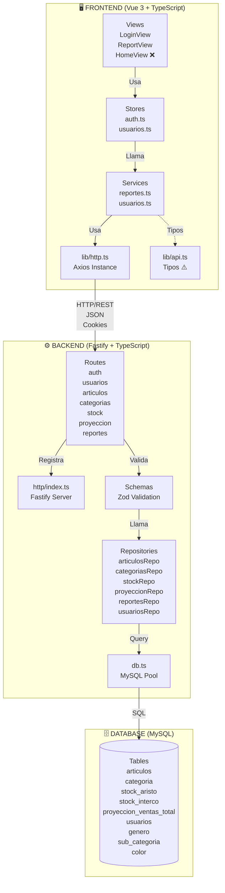
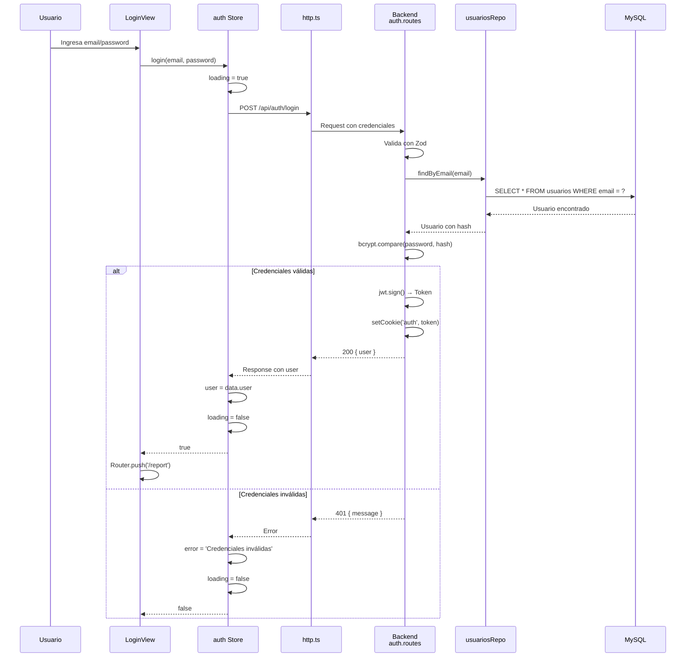
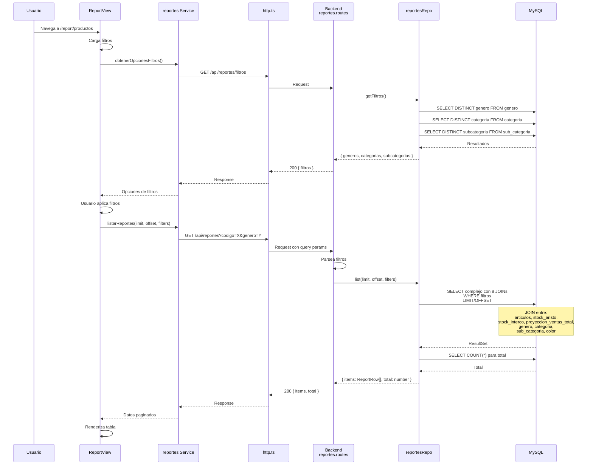
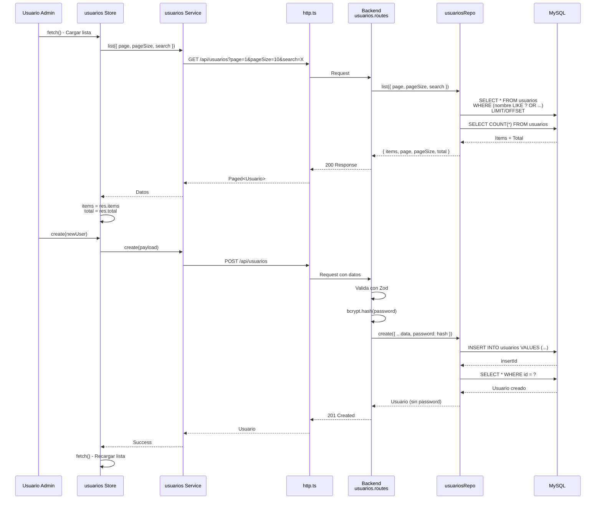
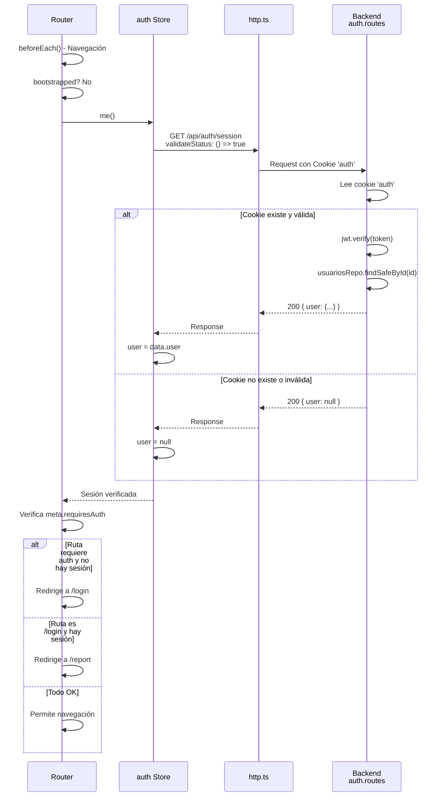
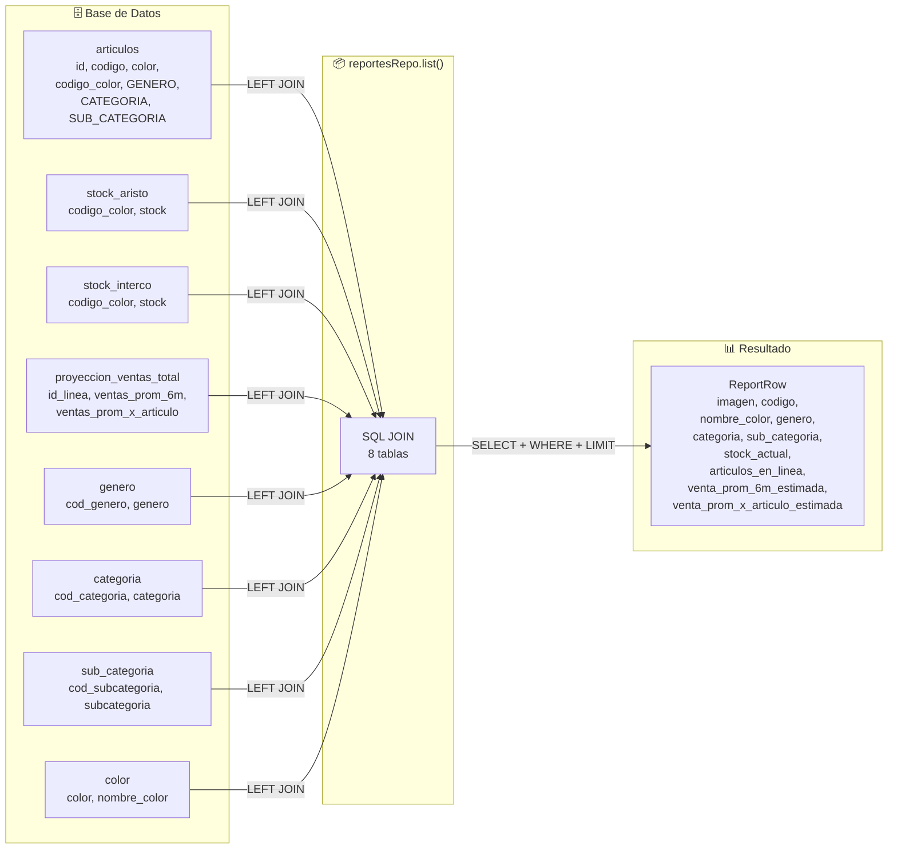
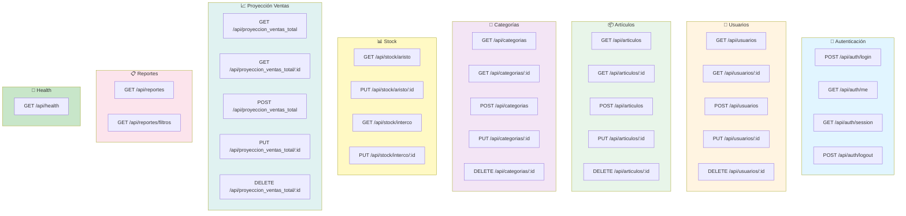

# Diagrama de Comunicación - Fase 2

## 🔄 Diagrama de Arquitectura General



## 🔐 Flujo de Autenticación (Login)



## 📊 Flujo de Reportes (Consulta Compleja)



## 👥 Flujo de Gestión de Usuarios



## 🔄 Flujo de Verificación de Sesión (Router Guard)



## 📦 Estructura de Datos - Flujo de Reportes



## 🚨 Elementos No Utilizados (Marcados en Diagrama)

```mermaid
graph TD
    subgraph NO_USADOS["❌ NO UTILIZADOS"]
        P[Prisma Schema<br/>prisma/schema.prisma<br/>⚠️ Configurado pero no usado]
        PC[Prisma Config<br/>prisma.config.ts<br/>⚠️ No usado]
        CORE[core/<br/>Directorio vacío<br/>❌]
        HV[HomeView.vue<br/>Sin ruta definida<br/>❌]
        ISHTTPS[isHttps()<br/>Función no llamada<br/>❌]
        API_HTTP[api.ts → http<br/>Objeto no usado<br/>❌]
        API_API[api.ts → api<br/>Objeto no usado<br/>❌]
    end

    subgraph USADOS["✅ UTILIZADOS"]
        HTTP_FILE[http.ts<br/>✅ Usado en servicios]
        API_TYPES[api.ts → Tipos<br/>✅ Usado en stores]
    end

    style P fill:#ffcccc
    style PC fill:#ffcccc
    style CORE fill:#ffcccc
    style HV fill:#ffcccc
    style ISHTTPS fill:#ffcccc
    style API_HTTP fill:#ffcccc
    style API_API fill:#ffcccc
    style HTTP_FILE fill:#ccffcc
    style API_TYPES fill:#ccffcc
```

## 🔗 Endpoints API - Mapa Completo



---

## 📝 Leyenda

- ✅ **Verde**: Elemento funcional y utilizado
- ⚠️ **Amarillo**: Elemento configurado pero no usado
- ❌ **Rojo**: Elemento no utilizado (código muerto)
- 🔐 **Azul claro**: Autenticación
- 📊 **Amarillo claro**: Datos/Reportes
- 📦 **Verde claro**: Entidades principales

---

**Nota**: Estos diagramas muestran la comunicación real entre componentes. Los elementos marcados con ❌ o ⚠️ deberían ser eliminados o implementados según las recomendaciones del análisis.


